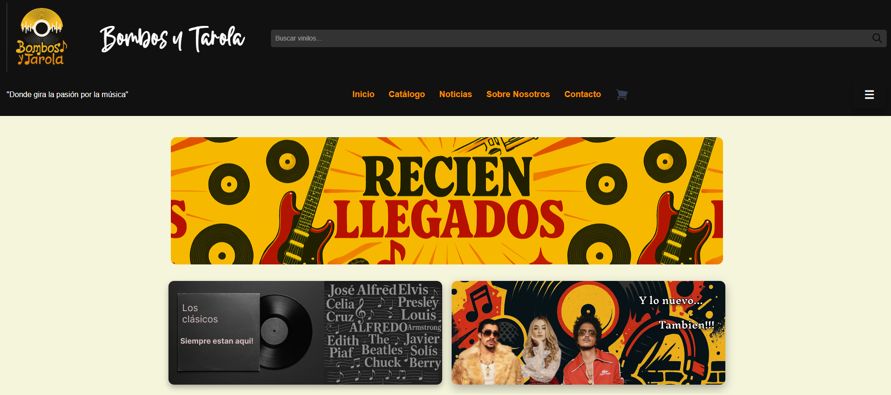
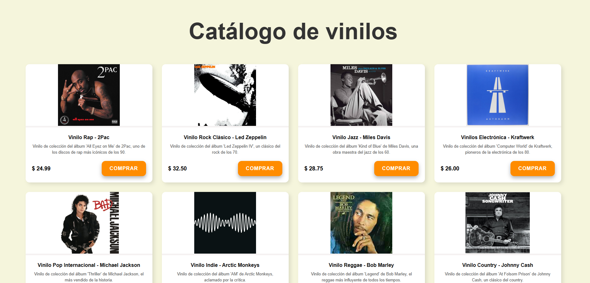
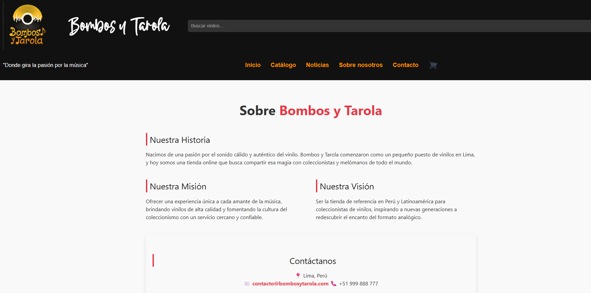

# 🎶 Bombos y Tarola

Tienda online de vinilos desarrollada con **React**.  
Permite navegar por un catálogo dinámico, agregar productos al carrito, suscribirse al newsletter, enviar mensajes de contacto y descargar el Libro de Reclamaciones en PDF.
 

---

## 🏫 Proyecto académico

Este proyecto fue desarrollado como parte de la carrera técnica en **Programación** del  
**Instituto San Agustín ISAT – 2025**.

---

## ✨ Características principales

- Catálogo de vinilos con sistema de carrito en tiempo real.
- Páginas: Inicio, Catálogo, Sobre Nosotros, Noticias y Contacto.
- Formulario de contacto funcional con Formspree.
- Newsletter para suscripciones.
- Descarga directa del **Libro de Reclamaciones** en PDF.

---

## 🌐 Demo en vivo
[🔗 Ver sitio desplegado](https://bombos-y-tarola.vercel.app/)  

---

## 🖼️ Vista previa





---

## ⚙️ Instalación y ejecución local

1. Clona el repositorio:

   ```bash
   git clone https://github.com/CarlitosFranco/bombos_y_tarola.git

Entra a la carpeta del proyecto:
    cd bombos_y_tarola

Instala las dependencias:
    npm install

Ejecuta el entorno de desarrollo:
    npm run dev
    Abre en tu navegador: http://localhost:5173

## 🛠️ Tecnologías utilizadas

React + Vite (Frontend)

CSS puro (estilos)

Formspree (manejo de formularios)

GitHub Pages/Vercel (despliegue)

## 📂 Estructura del proyecto


src/
 ├─ components/      # Componentes de React
 ├─ style/           # Archivos CSS
 ├─ img/             # Imágenes
 └─ App.jsx          # Componente principal


## 👤 Autor

Carlos Franco
GitHub

## 📝 Licencia

Este proyecto se distribuye bajo la licencia MIT.
Eres libre de usar, modificar y distribuir este código bajo los términos de dicha licencia.